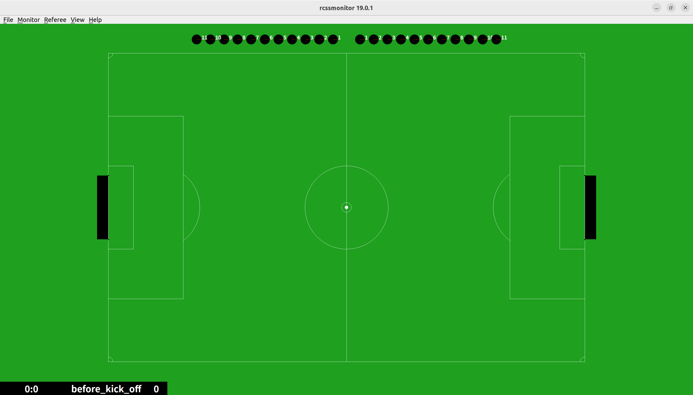
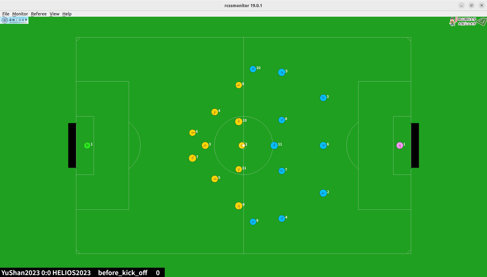

#  环境搭建 

1. 首先需要安装官方的monitor和server

   https://github.com/rcsoccersim/rcssmonitor

   RoboCup足球仿真模拟器监视器（rcssmonitor）用于通过连接到服务器（rcssserver）实时查看仿真过程，或者通过加载比赛日志文件查看仿真回放。

   https://github.com/rcsoccersim/rcssserver

   RoboCup Soccer Simulator Server （rcssserver） 是一款用于多智能体系统和人工智能的研究和教育工具。它允许 11 名模拟自主机器人球员踢足球 （football）。

   他俩的安装方式相似

   ```bash
   sudo apt update
   sudo apt install build-essential automake autoconf libtool flex bison libboost-all-dev
   ```

   下载最新的releases版本压缩包

   ```bash
   tar xzvfp rcssserver-x.x.x.tar.gz
   cd rcssserver-x.x.x
   ./configure
   make
   ```

   当时动态链接库找不到，错误如下
   ```bash
   (base) youzicha@youzicha-ASUS-TUF-Gaming-F15-FX507VV-FX507VV:~/Robocup/rcssserver-19.0.0/build$ rcssserver
   rcssserver: error while loading shared libraries: librcssclangparser.so.18: cannot open shared object file: No such file or directory
   ```

   解决方法

   ```bash
   (base) youzicha@youzicha-ASUS-TUF-Gaming-F15-FX507VV-FX507VV:~/Robocup/rcssserver-19.0.0/build$ sudo find / -name 'librcssclangparser.so*' 2>/dev/null
   /usr/local/lib/librcssclangparser.so.18
   /usr/local/lib/librcssclangparser.so.18.0.0
   /usr/local/lib/librcssclangparser.so
   /home/youzicha/Robocup/rcssserver-19.0.0/build/rcss/clang/librcssclangparser.so.18
   /home/youzicha/Robocup/rcssserver-19.0.0/build/rcss/clang/librcssclangparser.so.18.0.0
   /home/youzicha/Robocup/rcssserver-19.0.0/build/rcss/clang/librcssclangparser.so
   /home/youzicha/Robocup/rcssserver-19.0.0/rcss/clang/.libs/librcssclangparser.so.18
   /home/youzicha/Robocup/rcssserver-19.0.0/rcss/clang/.libs/librcssclangparser.so.18.0.0
   /home/youzicha/Robocup/rcssserver-19.0.0/rcss/clang/.libs/librcssclangparser.so
   # 发现能找到，更新缓存试试
   sudo ldconfig
   ```

   成功！

   ```bash
   rcsoccersim
   ```

   成功运行，截图如下

   

   接下来就是上场队员了，robocup仿真2d规定每队有11名队员和一名教练。

   目前我们没有代码，就先用robocup组委会提供的历年战队的二进制文件来作为我们的球队，来一场激烈的比赛把。link: http://archive.robocup.info/Soccer/Simulation/2D/

   这些都是已经封装好的代码，下载之后运行`./start.sh` 就可以看到球员已经上场了。

   我这里用安徽工业大学和日本的学校进行一次模拟赛，可以看到双方球员均已上场，ctrl+k进行比赛
   

   最终结果 YuShan2023 0:2 HELIOS2023

2. 编译HELIOS-BASE代码

   1. clone 代码

      ```bash
      git clone https://github.com/helios-base/helios-base.git
      ```

   2. 安装boost库，我这里选择的是1.38版本

      下载release版本的源码后，需要运行

      ```bash
      # 根据需要选择是否需要修改默认目录，默认目录位于/usr/local/include/boost-1_38/boost
      # 不同版本的安装方式不同
      ./configure
      make install
      ```

      > [!CAUTION]
      >
      > 1. 将目录修改为/usr/local/include/boost
      > 2. 或者修改makefile中的BOOST_CPPFLAGS = -I/usr/include/boost-1_38/

   3. 安装librcsc link: https://github.com/helios-base/librcsc

      ```bash
      sudo apt update
      sudo apt install build-essential libboost-all-dev autoconf automake libtool
      ./bootstrap
      ./configure --disable-unit-test
      make
      sudo make install
      ```

   4. 最终环境

      ```bash
      sudo apt update
      sudo apt install build-essential libboost-all-dev
      ./bootstrap
      ./configure
      make
      ```

      这一步遇到了错误

      ```bash
      make[3]: 进入目录“/home/youzicha/Robocup/helios-base/src/coach”
      g++ -std=c++17 -DHAVE_CONFIG_H -I. -I../..  -I../../src -I/usr/local/include/boost-1_38 -W -Wall -g -O2 -MT sample_coach-sample_coach.o -MD -MP -MF .deps/sample_coach-sample_coach.Tpo -c -o sample_coach-sample_coach.o `test -f 'sample_coach.cpp' || echo './'`sample_coach.cpp
      sample_coach.cpp: In member function ‘virtual bool SampleCoach::initImpl(rcsc::CmdLineParser&)’:
      sample_coach.cpp:185:28: error: ‘class rcsc::TeamGraphic’ has no member named ‘createXpmTiles’; did you mean ‘readXpmFile’?
        185 |             M_team_graphic.createXpmTiles( team_logo_xpm );
            |                            ^~~~~~~~~~~~~~
            |                            readXpmFile
      make[3]: *** [Makefile:388：sample_coach-sample_coach.o] 错误 1
      make[3]: 离开目录“/home/youzicha/Robocup/helios-base/src/coach”
      make[2]: *** [Makefile:399：all-recursive] 错误 1
      make[2]: 离开目录“/home/youzicha/Robocup/helios-base/src”
      make[1]: *** [Makefile:394：all-recursive] 错误 1
      make[1]: 离开目录“/home/youzicha/Robocup/helios-base”
      make: *** [Makefile:335：all] 错误 2
      ```

      这是库版本的问题，需要查看你所安装库的版本来解决这个问题，查看rcsc库的头文件（通常在`/usr/local/include/rcsc/team_graphic.h`）

      我这里需要修改成`fromRawXpm`方法

      还有一些问题

      ```bash
      这是什么错误
      bhv_penalty_kick.cpp: In member function ‘virtual bool Bhv_PenaltyKick::execute(rcsc::PlayerAgent*)’:
      bhv_penalty_kick.cpp:74:57: error: cannot convert ‘const rcsc::PenaltyKickState’ to ‘const rcsc::PenaltyKickState*’ in initialization
         74 |     const PenaltyKickState * state = wm.penaltyKickState();
            |                                      ~~~~~~~~~~~~~~~~~~~^~
            |                                                         |
            |                                                         const rcsc::PenaltyKickState
      bhv_penalty_kick.cpp: In member function ‘bool Bhv_PenaltyKick::doKickerReady(rcsc::PlayerAgent*)’:
      bhv_penalty_kick.cpp:283:57: error: cannot convert ‘const rcsc::PenaltyKickState’ to ‘const rcsc::PenaltyKickState*’ in initialization
        283 |     const PenaltyKickState * state = wm.penaltyKickState();
            |                                      ~~~~~~~~~~~~~~~~~~~^~
            |                                                         |
            |                                                         const rcsc::PenaltyKickState
      bhv_penalty_kick.cpp: In member function ‘bool Bhv_PenaltyKick::doShoot(rcsc::PlayerAgent*)’:
      bhv_penalty_kick.cpp:445:57: error: cannot convert ‘const rcsc::PenaltyKickState’ to ‘const rcsc::PenaltyKickState*’ in initialization
        445 |     const PenaltyKickState * state = wm.penaltyKickState();
            |                                      ~~~~~~~~~~~~~~~~~~~^~
            |                                                         |
            |                                                         const rcsc::PenaltyKickState
      make[3]: *** [Makefile:2227：sample_player-bhv_penalty_kick.o] 错误 1
      make[3]: 离开目录“/home/youzicha/Robocup/helios-base/src/player”
      make[2]: *** [Makefile:399：all-recursive] 错误 1
      make[2]: 离开目录“/home/youzicha/Robocup/helios-base/src”
      make[1]: *** [Makefile:394：all-recursive] 错误 1
      make[1]: 离开目录“/home/youzicha/Robocup/helios-base”
      make: *** [Makefile:335：all] 错误 2
      ```

      解决方法

      ```c++
      // 旧版本 (返回指针)
      const PenaltyKickState* penaltyKickState() const;
      
      // 新版本 (返回引用)
      const PenaltyKickState& penaltyKickState() const;
      
      - if (state->isKickTaker()) { ... }
      + if (state.isKickTaker()) { ... }
      
      - state->getKickerSide();
      + state.getKickerSide();
      ```

      最终，我们生成了`start.sh`文件，大功告成，但是base就是base，上来就被YuShan踢了个8:0